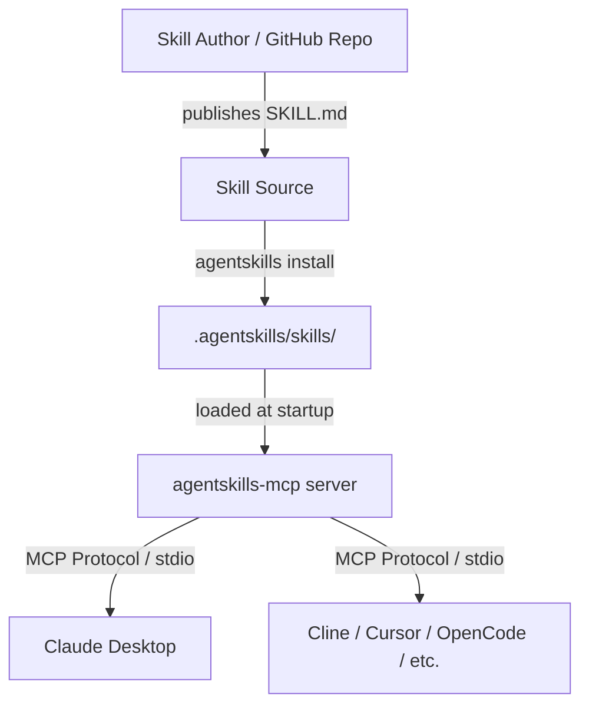

# System Overview

This section describes the internal structure of Agent Skills MCP for contributors and integrators. For usage documentation, see the [Guide](/guide/).

## System Context

Agent Skills MCP sits between skill authors/repos and MCP-compatible agents:



**Key principle**: The MCP server is **read-only**. It discovers, parses, and serves skill content. It never executes commands or interpolates arguments — that is the agent's responsibility.

## Data Flow

### Installation

```
package.json
  agentskills field
       │
       ▼
agentskills install
  │  fetches via Pacote (git, local, tarball, npm)
  │  validates SKILL.md
  ▼
.agentskills/skills/<name>/SKILL.md
.agentskills/skills.lock
```

### Runtime

```
agentskills-mcp starts
  │  reads .agentskills/skills/
  │  parses each SKILL.md
  │  builds in-memory SkillRegistry
  ▼
Agent connects via MCP (stdio)
  │
  ├─ lists tools → use_skill (enum of skill names)
  ├─ lists resources → skill://<name> URIs
  │
  ▼
Agent calls use_skill(skill_name: "git-workflow")
  │  registry.getSkill("git-workflow")
  │  returns { instructions: <raw body> }
  ▼
Agent receives raw Markdown instructions
  interprets, interpolates $ARGUMENTS, executes
```

## Security Boundary

```
┌─────────────────────────────────────┐
│  Agent (Trusted)                    │
│  • Decides what to execute          │
│  • Has user context and permissions │
└──────────────┬──────────────────────┘
               │ MCP Protocol
┌──────────────▼──────────────────────┐
│  MCP Server (Semi-Trusted)          │
│  • Read-only file access            │
│  • No command execution             │
│  • Returns raw skill content        │
└──────────────┬──────────────────────┘
               │ File System (Read)
┌──────────────▼──────────────────────┐
│  Skills (Untrusted)                 │
│  • Treated as data, not code        │
│  • May contain dynamic commands     │
│    (returned raw, never executed)   │
└─────────────────────────────────────┘
```

## MCP Interface

The server exposes:

**Tool: `use_skill`**

- `skill_name`: enum of all loaded skill names
- `arguments`: optional object for context
- Returns: `{ instructions: "<raw body>" }`

**Resources**

- `skill://<name>` — full `SKILL.md` content as `text/markdown`
- Template: `skill://{skillName}` — parameterized access

Skills are loaded once at startup. Restart the server to pick up newly installed skills.
