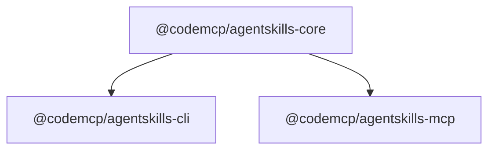

# Package Structure

The project is a **pnpm workspace monorepo** with three published packages and a demo directory. Build orchestration uses [Turbo](https://turbo.build/).

## Dependency Graph



The core package is the only shared dependency. CLI and MCP server are independent consumers of it.

## `@codemcp/agentskills-core`

**Path:** `packages/core/`

The shared foundation. Contains no CLI or server logic — only pure processing concerns.

| Module                      | Responsibility                                                               |
| --------------------------- | ---------------------------------------------------------------------------- |
| `parser.ts`                 | Extract YAML frontmatter + Markdown body from `SKILL.md` using `gray-matter` |
| `validator.ts`              | Validate a parsed skill against the Agent Skills standard                    |
| `registry.ts`               | In-memory `Map<string, Skill>` with O(1) lookup by name                      |
| `installer.ts`              | Download and install skills from any source using Pacote                     |
| `package-config.ts`         | Read and write the `agentskills` field in `package.json`                     |
| `mcp-config-manager.ts`     | Read and write MCP client config files (per agent type)                      |
| `mcp-dependency-checker.ts` | Compare skill `requiresMcpServers` against agent config                      |
| `parameter-substitution.ts` | Resolve `{{PARAM}}` placeholders in MCP server arg specs                     |
| `types.ts`                  | All shared TypeScript interfaces and discriminated unions                    |

**Key design choices:**

- `ParseResult` and `InstallResult` are discriminated unions (`success: true | false`) — no exceptions for expected failures
- `SkillRegistry` is loaded once and is immutable; no hot reload in the current version
- All file I/O is async; parallel loading where possible

## `@codemcp/agentskills-cli`

**Path:** `packages/cli/`
**Bin:** `agentskills`

A short-lived process — it initializes a fresh registry per command and exits. Uses `commander` for argument parsing.

| Module                 | Command                                      |
| ---------------------- | -------------------------------------------- |
| `commands/add.ts`      | `agentskills add <name> <spec>`              |
| `commands/install.ts`  | `agentskills install [--agent] [--with-mcp]` |
| `commands/list.ts`     | `agentskills list`                           |
| `commands/validate.ts` | `agentskills validate <path>`                |

The `add` command validates before writing — the spec is fetched, the `SKILL.md` is parsed and validated, and only a clean result updates `package.json`.

## `@codemcp/agentskills-mcp`

**Path:** `packages/mcp-server/`
**Bin:** `agentskills-mcp`

A long-lived process. The `MCPServer` class accepts a `SkillRegistry` via dependency injection and wires it to the `@modelcontextprotocol/sdk` over stdio transport.

| Module      | Responsibility                                                    |
| ----------- | ----------------------------------------------------------------- |
| `server.ts` | `MCPServer` class: registers `use_skill` tool + resource handlers |
| `bin.ts`    | Entry point: loads registry, starts server                        |

`MCPServer` registers handlers before connecting to the transport (required by the SDK). The `use_skill` tool's `skill_name` enum is built dynamically from the registry at startup.

## Demo Package

**Path:** `packages/demo/`

Contains example `SKILL.md` files for manual testing and as reference implementations. Not published.

## Build Order

```
core (build)
  │
  ├─▶ cli (build)
  └─▶ mcp-server (build)
```

CLI and MCP server build in parallel after core. Turbo handles caching and incremental builds.

## Testing

Tests use [Vitest](https://vitest.dev/). Each package has its own test suite:

```
packages/core/src/*.test.ts       # Unit tests for all core modules
packages/cli/src/commands/*.test.ts
packages/mcp-server/src/*.test.ts
```

Run all tests from the root:

```bash
pnpm test
```
